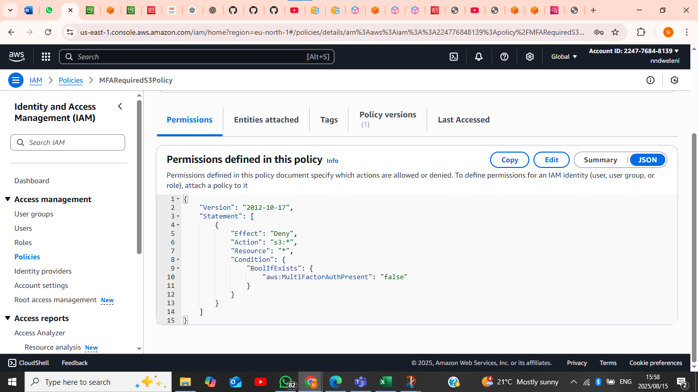
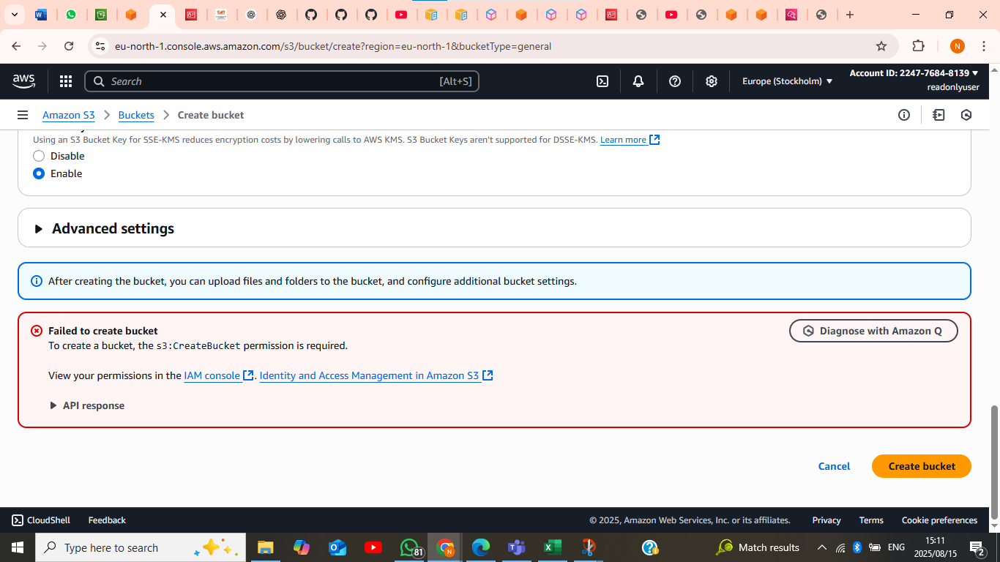
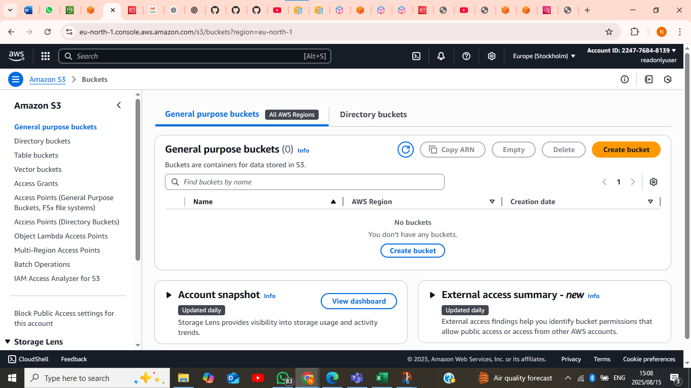

## 🔐 MFA Policy
- Requires users to have MFA enabled before performing sensitive operations.  
- JSON file: [MFAPolicy.json](policies/MFAPolicy.json)  
- Proof:   

## 📂 S3 ReadOnly Policy
- Grants read-only permissions on all S3 buckets.  
- Allows `s3:Get*` and `s3:List*` actions.  
- JSON file: [S3ReadOnlyPolicy.json](policies/S3ReadOnlyPolicy.json)  
- Proof:   

## 📝 Additional Proof
- IAM policies attached successfully:   
- S3 bucket list access test:   

