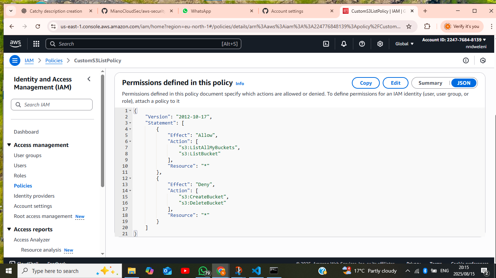
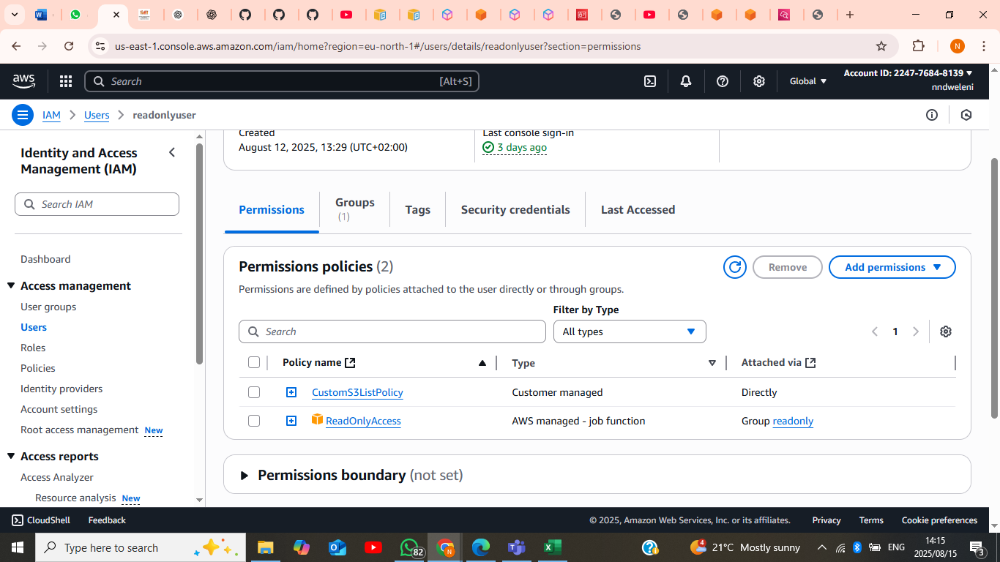
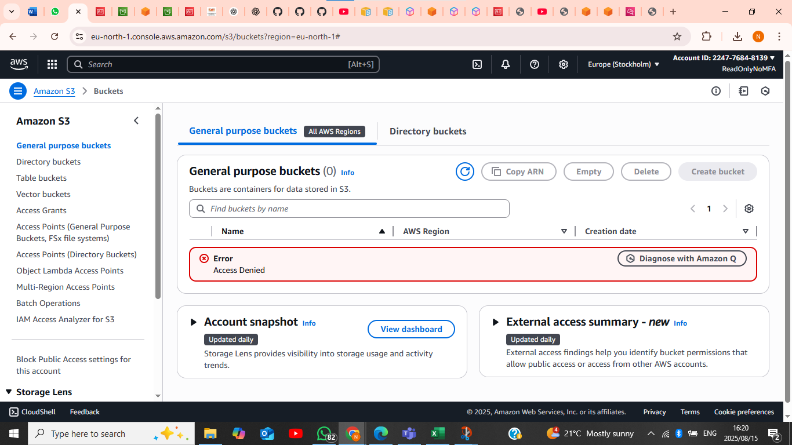

# AWS Security Foundations – Week 2  

This project demonstrates the implementation of **Identity and Access Management (IAM) security controls** and **S3 bucket access restrictions** in AWS.  
The goal was to enforce **Multi-Factor Authentication (MFA)** for sensitive operations, apply **least privilege principles**, and verify that policies correctly deny unauthorized actions.  

---

## 🎯 Project Objectives  

1. Create and enforce a custom **MFA policy** that requires all users to authenticate with MFA before performing sensitive actions.  
2. Develop and apply a **custom S3 ReadOnly policy** that allows users to view bucket contents but not create or delete buckets.  
3. Test and validate the policies by attempting restricted actions (e.g., creating buckets, accessing without MFA) and capturing proof of enforcement.  

---

## 🔑 MFA Policy  

**Purpose:** Enforce MFA for IAM users before allowing them to perform certain AWS actions.  

- **Policy File:** [policies/MFAPolicy.json](policies/MFAPolicy.json)  
- **Highlights:**  
  - Requires users to be MFA authenticated.  
  - Blocks access if MFA is not enabled.  

**Proof:**  
  

---

## 📂 S3 ReadOnly Policy  

**Purpose:** Apply least privilege to ensure users can only **view** S3 resources but cannot create or delete them.  

- **Policy File:** [policies/S3ReadOnlyPolicy.json](policies/S3ReadOnlyPolicy.json)  
- **Highlights:**  
  - Allows `s3:Get*` and `s3:List*` actions.  
  - Denies write actions like `s3:Put*` and `s3:Delete*`.  

**Proof:**  
  
  

---

## 📸 Policy Attachments and Testing  

### Attached Policies  
The policies were successfully attached to IAM users.  
  

### Bucket List Access (Read-Only User)  
User could list buckets but not modify them.  
  

### Access Denied (Non-MFA Login)  
A user without MFA was denied access, proving the MFA enforcement policy works.  
  

### Bucket Creation Error (Read-Only User)  
The ReadOnly user attempted to create a bucket but failed, confirming least privilege was enforced.  
  

---

## ✅ Key Takeaways  

- Enforced **MFA** across IAM users to strengthen account security.  
- Applied **least privilege** using custom policies, ensuring users only had the access required.  
- Verified enforcement through **real-world tests** that resulted in expected errors and denials.  
- Captured and documented proof (screenshots + JSON policy files) to demonstrate implementation success.  

---

## 📂 Repository Structure  

